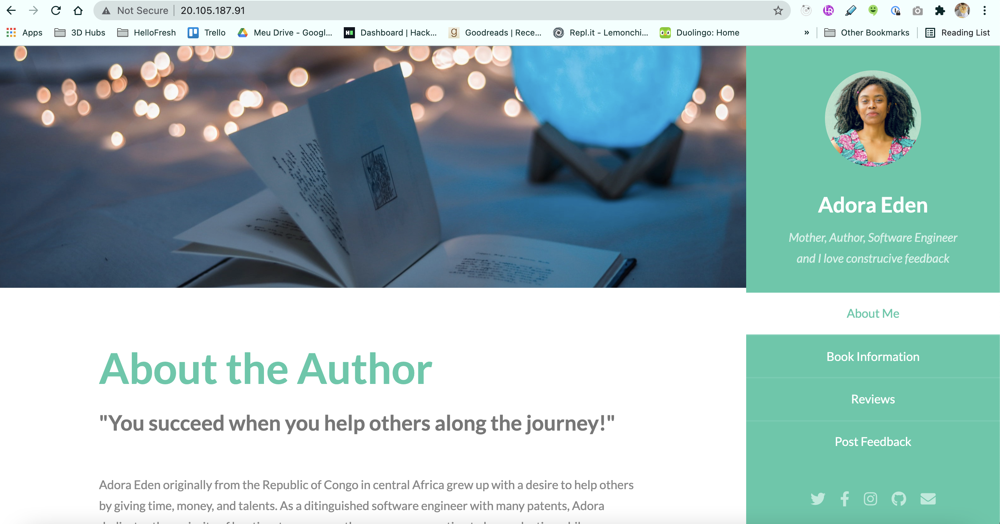

# Migrating Web Applications



## Lift and Shift Migration with Load Balancer


For each Virtual Machine, deploy content to the Website using SCP at following directory `/home/book_admin/web`

* With SSH:

```
scp -ri ~/.ssh/vm2-ssh-key-pair.cer ./web/ book_admin@20.56.48.12:/home/book_admin/web
scp -ri ~/.ssh/vm1_key.cer ./web/ book_admin@51.136.115.72:/home/book_admin/web 
```

* With User and Password

```
scp -r ./web/ book_admin@40.67.208.11:/home/book_admin/web
scp -r ./web/ book_admin@40.67.210.184:/home/book_admin/web 
```

## Troubleshooting

———————————— STACKOVERFLOW ——————————
https://learn.akamai.com/en-us/webhelp/netstorage/netstorage-user-guide/GUID-F9717DFA-6391-409B-8C47-8B0F9520854E.html

https://stackoverflow.com/questions/29933918/ssh-key-permissions-0644-for-id-rsa-pub-are-too-open-on-mac

```
@@@@@@@@@@@@@@@@@@@@@@@@@@@@@@@@@@@@@@@@@@@@@@@@@@@@@@@@@@@
@         WARNING: UNPROTECTED PRIVATE KEY FILE!          @
@@@@@@@@@@@@@@@@@@@@@@@@@@@@@@@@@@@@@@@@@@@@@@@@@@@@@@@@@@@
Permissions 0644 for '/Users/tudouya/.ssh/vm/vm_id_rsa.pub' are too open.
It is required that your private key files are NOT accessible by others.
This private key will be ignored.
bad permissions: ignore key: /Users/tudouya/.ssh/vm/vm_id_rsa.pub
Permission denied (publickey,password).
```

```
chmod 400 ~/.ssh/id_rsa
chmod 400 ~/.ssh/vm2-ssh-key-pair.cer
chmod 400 ~/.ssh/vm1_key.cer 
```
